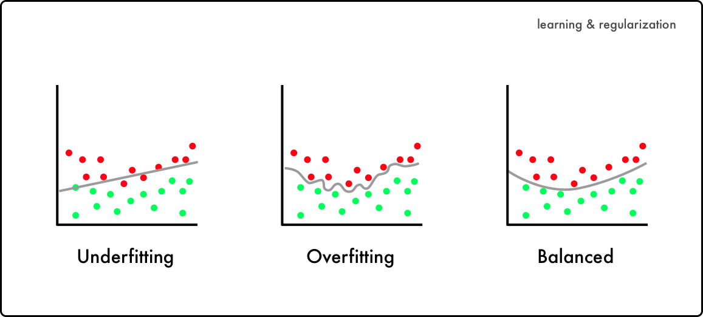
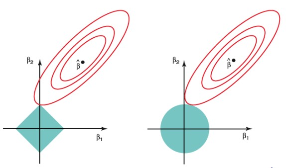

```{r setup, include=FALSE}
knitr::opts_chunk$set(echo = TRUE, warning = FALSE)
```
The goal of Statistical Learning is to use a set of tools in order to understand data.
These tools can be applied for either __supervised__ or __unsupervised__ problems.

- Supervised Statistical Learning consists in the development of a model for prediction or estimation of an output based on one or more inputs.
- In unsupervised Statistical Learning instead there is no output and the goal is to describe the association and patterns that can be found in the input data.

Examples of this: 

- Given a sample of individuals for which we know a set of variables (their height, weight, age, does smoke, has a family history of heart attacks) we would like to classify individuals in either healthy or unhealty w.r.t heart diseases.
- Given a sample consisting in the genome of some individuals for which we dont know their origin we  would like to define different _clusters_ of origin.


# Supervised Learning
In a SL scenario we have 

- An outcome measurement, which can either be qunatitative (for __regression problems__) or categorical (for __classification problems__).
Examples of this are the level of prostate specific antigen in individuals that could be affected by prostate cancer (regression), or heart attack or no heart attack classes (represented as 0/1) for classification.
- A set of features upon which we will base the model for prediction
- A training set of data, upon which we will build the model 
- A test set of data, upon which we will test the accuracy of the model

#### General framework for Supervised Learning
To understand how Supervised Learning is carried out we will use the prostate cancer dataset.
To load it, we will do the following: 
```{r}
library(ElemStatLearn) #To import the Element of Statistical Learning library
data("prostate") #To load the "Prostate" dataset 
names(prostate) #To display the name of eac column of the dataset 

summary(prostate) #To display summary statistics on the dataset
```

For this problem we would like to estimate _lpsa_, which is the logarithm of Prostate Specific Antigen concentration, the higher the value, the more likely an individual has prostate cancer.

In general, for such a quantitative (or regression) problem, we can write it as a problem in which we have a $Y$ (the quantitative response) and $p$ different predictors $X_1, X_2, ..., X_p$.

We assume that there is a relation between the set of predictors $X$  and $Y$, which can be written as $Y = f(X) + \epsilon$, where $f(X)$ is an unknown function that represent the systematic information that $X$ provides about $Y$ and $\epsilon$ is a __systematic error__, which cannot be avoided and is independent of $X$, and has mean $0$.

Since the error averages zero, we can predict $Y$ using $\hat{Y} = \hat{f}(X)$ where:

- $\hat{f}(X)$ represents our estimate of the function $f$
- $\hat{Y}$ represents the resulting prediction of the true value $Y$

The model created will have two error components, which are the __irreducible__ and __reducible error__.
The reducible error is error that can be reduced by increasing the accuracy of our model, this is done by applying the most appropriate model for the prediction we want to perform.
The irreducible error which we denoted as $\epsilon$, which is part of the function describing the relation between $Y$ and $X$ cannot be reduced, and it can thought as a _measurement error_.
This value may contain unmeasured variable that are useful for the estimate of $Y$ or may include unmeasurable variation.


Why would be interested in the estimation of $f$?
To understand the relation between $Y$ and $X$ we can understand how $Y$ changes as a function of $X$.
To do so we need to know the exact form that $\hat{f}$ has, otherwise it would be impossible to improve the model we are building.

Different linear and non-linear approaches exists for the estimation of $f$, but they share some similarities.
They both have a training set, which is the set of observation in the data used for the training of the model for the estimation of $f$.

Then the training set consists in the ${(x_1, y_i), (...), (x_n, y_n)}$ where $x_i = (x_{i1}, x_{i2},...,x_{ip})^T$ i.e. the vectors of values found at each row is transposed to a column vector and then used for the estimation.

Within this framework, two types of methods can be applied: __parametric__ and __non-parametric__.

#### Parametric methods
This two-step model-based approach consists in:

- 1. An assumption about the shape of $f$ is done. For example that $f$ is linear for $X$, or:
$$f(X) = \beta_0 + \beta_1X_1 + \beta_2X_2 + ... + \beta_pX_p$$
This simplifies the estimation of $f$ as we simply have to estimate the coefficient $\beta_0,...,\beta_p$.

- 2. A procedure for the _fitting_ (or _training_) of the model is carried out, which in our case consists in the estimation of the parameters $\beta_0, ..., \beta_p$.
The most common approach is the ordinary least squares, which consists in the minimisation of the RSS (residual sum of squares), computed as $\sum_{i =1}^{n}(y_i - f(X_i))^2$. It is important to note that other ways of fitting the linear model exists.

This model reduces the complexity of building the model because it comes down to the estimation of the set of parameters for the model $f$.

The issue with such models is that more often than not the the model we choose will not match the true unknown $f$.

We could solve the problem by selecting flexible models that can fit many different functions forms of $f$.

This cannot always be the case, because such models require a great number of parameters and this may lead to __overfitting__. Overfit models can predict perfectly data already used to build the model but fall short when presented with new data.



Resolving to a very flexible approach may be a solution, as such models do not make an assumption about a particular function form, which means that the danger of choosing a function that does not fit well the data is avoided.
On the other hand, such models require a very large number of observation to obtain an accurate estimation of $f$.

Which one should we choose?

If we are interested in inference (i.e., understand which and by how much each parameters can explain $Y$) then a restrictive model is much more interpretable, compared to more flexible ones.

If the goal is only prediction, a more flexible approach could make more sense. It is important to note that flexible approaches have an higher potential of overfitting if they are highly flexible methods. 

No method is better than all the others, and to understand which one we should choose trial and error by using different methods is of utmost importance.


#### Measuring the quality of fit
To evaluate the performance of a model on a given data set, different metrics can be used.

In a regression setting, the most used measure is the __Mean Squared Error__ or MSE, it is computed as 

$$MSE = \frac{1}{n}\sum_{i=1}^n(y_i-\hat{f}(x_i))^2$$
Which computes how far the predict value is from the actual one on average.

This metric can be used not only on the training data, but also on unseen data (the __test data__).
In fact, we are more interested in minimising the MSE of the test data.

If a test data set is available we could use it to compute the test MSE, but that is not always the case.
Furthermore, if no test data is available, minimising the training MSE is not always equivalent to minimising the test MSE.

If a method yields a low training MSE but an high test MSE then we say that there is overfitting, i.e. our model describes very well the training data but it does not describe accurately the test data.

One step we could take to avoid this condition and to estimate the test MSE is by performing __cross-validation__.

The issue of minimising the test error requires to minimise both the variance and the bias of a model.

- Variance refers to the amount by which $\hat{f}$ (i.e. the estimate of a function) would change if we estimated it using a different training data set. Ideally we would want a low variance, more flexible statistical methods have an higher variance.

- Bias refers to the error introduced by approximating a real problem, the bigger the approximation, the bigger the bias (as we may be ignoring some important variables that we dont take into account). 
More flexible methods tend to have lower bias.


The rate of change between variance and bias determines the value of the MSE.
As the flexibility of a method increases the bias of the model tends to decrease faster than by the amount for which the variance increases, resulting in a decrease in the test MSE.
However at some point the increase of flexibility wont impact the bias much but it will dramatically increase the variance, resulting in an increase in the test MSE.

The relationship between Bias, Variance and test MSE is referred as the bias-variance trade-off.
A good test set performance requires low variance and low bias.

The challenge in data science is finding a model for which both variance and bias is low.
In real life where $f$ is unobserved it is not possible to compute the MSE, bias or variance for a method.
Yet, it is important to keep it in mind.

## Classification Problems 

The classification problems is the following:
Starting from a dataset containing a set of observation $\{x_1,.., x_n\}$, each having an explanatory variable $\{y_1,.., y_n\}$ which are _categorical_.
To estimate the accuracy of the model the most used metric is the misclassification error rate, which is measured as 
$$\frac{1}{n}\sum_{i=1}^{n}I(y_i \neq \hat{y}_i)$$ 
which consists in counting the amount of misclassified entries divided by the number of total entries in the dataset.
To understand how well our model actually performs in previously unseen data we need to know the average misclassification test error rate or 

$$Ave(I(y_0 \neq \hat{y}_0)$$
A good classifier is one for which the test error rate is the smallest.
The model that best minimises the probability of misclassification is the _Bayes Classifier_.
It works by assigning a test observation with predictors $x_0$to the class $h$ for which 
$$P(Y = h | X = x_0) \text{is the largest.}$$
Meaning that it will assign an observation to a class for which the observation belongs to with highest probability. 
For example, in a problem in which there are 2 classes, the Bayes Classifier consists in predicting if $P(Y = 1|X=x_0) > 0.5$ and class two otherwise.

This probability is computed via the __Bayes Theorem__.
$$P(Y=y|X=x_0) \frac{\pi_hf_h(x_0)}{\sum_{l=1}^K\pi_lf_l(x_0)}$$
where 

- $\pi_h$is the __a priori probability__ of belonging to population h (for example, the probability of having a certain disease in the global population is $\frac{1}{10}$)

- $f_x(x_0)$ is the function describing the probability of observing $x_0$ if it belongs to the population $h$ (known as likelihood)
- $P(Y=h|X=x_0)$ is the __posterior probability__ of belonging to the population $h$ given that we observed $x_0$

To understand this, a simulated dataset is used, in which there are two predictors $X_1$ and $X_2$, each coming from a standard normal distribution with different mean $\mu$ and variance $\sigma$.

```{r echo=F}
library(mvtnorm) #To load the multivariate normal distribution library
library(ggplot2) #To load the ggplot library for pretty plotting

#We define the parameters to generate the two distributions
mu0 <- c(-2, 1.5) #Mean vector for population 0
mu1 <- c(-1, 1) #Mean vector for population 1

sigma0<-matrix(c(1,-0.5,-0.5,1),2,2) # covariance matrix of Population 0
sigma1<-matrix(c(1,0.5,0.5,1),2,2) # covariance matrix of Population 1


# The grid of points for the two functions is generated
x1.new<-seq(from=-5,to=2,length.out=100) 
x2.new<-seq(from=-2.5,to=5,length.out=90)

x.new<-expand.grid(x=x1.new,y=x2.new) # then, they are merged together onto a single object

## The likelihood function of both populations are generated
dx.new.0<-dmvnorm(x.new,mean=mu0,sigma=sigma0)
dx.new.1<-dmvnorm(x.new,mean=mu1,sigma=sigma1)

# To generate a nice plot the likelihood and the grid of points are merged together into 
# Dataframe objects, and they get a label assigned
df.0<-as.data.frame(cbind(x.new,dx.new.0))
df.1<-as.data.frame(cbind(x.new,dx.new.1))
names(df.0)[3]<-"likelihood"
names(df.1)[3]<-"likelihood"
df.0$population<-"0"
df.1$population<-"1"
df.0.1<-rbind(df.0,df.1)

# The likelihood functions are plotted using ggplot
ggplot(df.0.1, aes(x=x, y=y,fill=likelihood) ) +
  geom_raster()+
  theme_minimal()+
  scale_fill_viridis_c()+
  facet_wrap(~population)

# The posterior probability is computed.
# Given that there is a 50% chance of being either part of population 0 or 1
# the a priori probability is 0.5, and the posterior probability is computed as
# the sum of the a priori probability of belonging to population 0 times the 
# likelihood of population 0 plus the a priori probability of belonging to population
# 1 times the likelihood of belonging to population 1
posterior.x.new0<-(0.5*dx.new.0)/(0.5*dx.new.0+0.5*dx.new.1)
length(posterior.x.new0)

# Plotting the data 
# In order to plot the points with different shades according to the class
# membership, we need to put the vector of posterior probabilities into
# a matrix representing the plane.
post.x0<-matrix(posterior.x.new0,length(x1.new),length(x2.new))
contour(x1.new,x2.new,post.x0,levels=0.5,xlab="x1",ylab="x2",
        main="Bayes decision boundary",labels="")
points(x.new,pch=".",cex=1.2,col=ifelse(posterior.x.new0>0.5,"coral",
                                        "cornflowerblue"))
```
The final plot shows what is called the __Bayes decision boundary__.
It represents the region for which a point is classified for either one class or some other.
The test error rate computed with the Bayes Classifier is called __Bayes error rate__, and it represents the lowest possible error rate we can achieve.
It is computed as 
$$1-E(\max{P(Y=h|X)}$$
To compute it, we are first going to compute the posterior probability (found using the Bayes theorem), then, by merging together the two posterior probabilities we are going to apply the formula.

```{r}
# Estimation of Bayes error
posterior.x.new0<-(0.5*dx.new.0)/(0.5*dx.new.0+0.5*dx.new.1)
posterior.x.new1<-(0.5*dx.new.1)/(0.5*dx.new.0+0.5*dx.new.1)

post.matrix<-cbind(posterior.x.new0,posterior.x.new1)


# Compute the error
1-mean(apply(post.matrix,1,max)) 
# Here we are going to apply to the object post.matrix (the matrix of posterior probabilities)
# the max function, and we are going to using by applying it row by row (hence the value 1)


# By plotting the two functions and the error we can see how the error increases
# as we reach a point in which the two gaussian functions overlap (as their mean)
# has a small difference.

# Plot posterior and error
df.posterior.0<-as.data.frame(cbind(x.new,posterior.x.new0))
df.posterior.1<-as.data.frame(cbind(x.new,posterior.x.new1))
df.error<-as.data.frame(cbind(x.new,1-apply(post.matrix,1,max)))
names(df.posterior.0)[3]<-"value"
names(df.posterior.1)[3]<-"value"
names(df.error)[3]<-"value"
df.posterior.0$population<-"posterior 0"
df.posterior.1$population<-"posterior 1"
df.error$population<-"error"
df.posterior<-rbind(df.posterior.0,df.posterior.1,df.error)
ggplot(df.posterior, aes(x=x, y=y,fill=value) ) +
  geom_raster()+
  theme_minimal()+
  facet_wrap(~population)+
  scale_fill_viridis_c()
```
Given that the Bayes Classifier is the best classifier among all others, what is the point of developing other classifiers?

Unfortunately, for the Bayes Classifier to work we need to observe the entire population in order to compute $P(Y=h|X=x_0)$, which is in almost all cases impossible to obtain.

The purpose of the Bayes Classifier is to use it for comparison with a model we have built:
as we said, the Bayes classifier yields the lowest misclassification error rate, hence, by using the test data coming from our sample we could test both our model and a Bayes Classifier and see how close the two error rates are.

An additional visualisation of the accuracty of a model is via a confusion matrix.

The confusion matrix is used to compare the model prediction vs the actual class from which a sample came, and it can be used not only for binary classification but it can also be extended to n-ary classification.

For binary classification, this is what a confusion matrix looks like:

The vales found on the main diagonal of the matrix (excluding the total) represent the correctly classified samples.
A useful metric to understand the efficacy of a classifier is its accuracy, computed as 

$$\frac{TP+TN}{P+N}$$
To find its misclassification rate or error rate we can do $1-\text{accuracy}$ or 
$$\frac{FP+FN}{P+N}$$

More often than not we will deal with problems in which there is a huge imbalance between the number of samples coming from one class or the other, in these cases other metrics such a sensitivity and specificty come to our help:

Specificity is true positive rate, i.e. 
$$\frac{TP}{P}$$
And sensitivty is the true negative rate
$$\frac{TN}{N}$$
Also, precision, computed as 
$$\frac{TP}{TP+FP}$$
and recall 
$$\frac{TP}{TP+FN} \rightarrow \frac{TP}{P}$$
can be found sometimes, and are used to compute the F-score
$$\frac{2 \cdot \text{precision} \cdot \text{recall}}{\text{precision} + \text{recall}}$$

The following code displays how to create a confusion matrix for a 2 class Bayes classifier.

```{r}

set.seed(1234) # We set a seed to obtain always the same sample when using the rmvnorm function.
n0<-100
n1<-100
# The object x0 and x1 contain the X values of the test set 
x0<-rmvnorm(n0,mean=mu0,sigma=sigma0)
x1<-rmvnorm(n1,mean=mu1,sigma=sigma1)
x<-rbind(x0,x1) #The two values coming from each distribution are merged together into a single object
y<-rep(0:1,each=100) #The test y variable is created, the first 100 entries come from the distribution 0 and the other 100 from distribution 1

# We replot the Bayes decision boundary using the values computed previously from the training data
contour(x1.new,x2.new,post.x0,levels=0.5,xlab="x1",ylab="x2",
        main="Bayes decision boundary",labels="")
points(x.new,pch=".",cex=1.2,col=ifelse(posterior.x.new0>0.5,"coral",
                                        "cornflowerblue"))
# Then, to visualise were the point of each distribution lie in the BDD we plot the points taken from the test set over the initial
# graph, coloring them based on the population (and class) they belong to.
points(x,col=ifelse(y==0,"coral","cornflowerblue"),lwd=2)

# The likelihood and posterior probability for each point is computed 
dx0<-dmvnorm(x,mean=mu0,sigma=sigma0)
dx1<-dmvnorm(x,mean=mu1,sigma=sigma1)

post.0<-0.5*dx0/(0.5*dx0+0.5*dx1)
yhat<-ifelse(post.0>0.5,0,1)

# The confusion matrix is created by using a table containing in a column 
# the estimated Ys and on the other the true y.
confusion.m<-table(yhat,y)
confusion.m

# On the main diagonal the correctly classified samples are found, hence 
# by summing them and dividing by the number of overall samples we can compute the 
# accuracy 
sum(diag(confusion.m))/200

# The classification error is given by doing 1-accuracy
1-sum(diag(confusion.m))/200


# Ggplot2 can be used to better display the confusion matrix
library(reshape)
melt.confusion.m <- as.data.frame(melt(confusion.m))
ggplot(melt.confusion.m,aes(x=as.factor(y),y=as.factor(yhat),fill=value))+
         geom_tile()+
         scale_fill_viridis_c()+
         theme_minimal()+
         xlab("True y")+
         ylab("Predicted y")+
         geom_text(aes(label = round(value, 1)))

#we can also compute the sensitivity and the specificity
sensitivity <- confusion.m[1, 1]/200
sensitivity

specificity <- confusion.m[2,2]/200
specificity
```

## Logistic Regression

To understand how classification is carried out (specifically using a logistic regression model) we are going to use the South African Heart Disease dataset.

```{r}
#First, we are going to import it from the ElemStatisticalLearning library 
library(ElemStatLearn)
data("SAheart")

#Lets see what are the names of each variables and what they look like
names(SAheart)
summary(SAheart)
```
We are interested in finding if a given individual is or is not affected by CHD (Coronary Heart Disease).
Hence, our $Y$ is chd, and the vector $X$ consists of all the other variables.
If we were to take a look at all the unique values found in the chd variables we will notice that there only two classes, 0 and 1, meaning presence or absence of chd:
```{r}
unique(SAheart$chd)
```

Intuitively what we could do is to build a linear regression model for which 
$$
\begin{equation}
Y = 
  \begin{cases}
    1, \text{ if chd} \\
    0, \text{otherwise}
  \end{cases}
\end{equation}
$$

The issue with using a linear regression for such an approach is the following:
```{r}
#We build a linear regression model using chd as Y and tobacco consumption as X

model <- lm(chd~tobacco, data=SAheart)
plot(x=SAheart$tobacco, y=SAheart$chd, xlab="Tobacco consumption", ylab="chd")
abline(model, col="red")
```

While it may not be immediately noticed, this model will give a probability greater than 1 for individuals with a tobacco consumption greater than 25kg, which doesn't make much sense.
What we need is a model for which the probability given $X$ is between 0 and 1, such as the logistic regression, which is defined as 

$$P(X) = \frac{e^{\beta_0 + \beta_1X}}{1+ e^{\beta_0 + \beta_1X}}$$

If we use a logistic regression with the same variables as the ones used for the linear regression the following results are obtained: 

Here, the probability of developing CHD increases as the tobacco consumption increases but it never reaches 1.

The logistic distribution can be transformed into

$$\frac{P(X)}{1-P(X)}=e^{\beta_0+\beta_1X}$$
The importance of this transformation is related to the vale $\frac{P(X)}{1-P(X)}$, which is also called __odds__, it is the fraction between the probability of an event $X$ to happen over the probability of it not happening.
By applying the logarithm to this expression we obtain
$$\log(\frac{P(X)}{1-P(X)}) = \beta_0 + \beta_1X$$
meaning that if we increase X by one unit the left hand side (known as log odds or __logit__) will increase by one, or equivalently the odds will be multiplied by $e^{\beta_1}$.

- If $\beta_1$ is positive, then increasing $X$ will result in an increase in $P(X)$

- If $\beta_1$ is negative, then increasing $X$ will result in a decrease in $P(X)$


The estimation of the parameters $\beta_0, \beta_1$ is done via maximum likelihood.

The objective is to find estimates for the two parameters such that the probability of chd corresponds as much as possible the true chd status observed, i.e.

- if an $i_\text{th}$ individual is 1 for chd, then we want the estimated probability $\hat{p}(x_i)$

In the case of binary classification, the likelihood function corresponds to the product of $n$ Bernoulli distributions:

$$\prod_{i=1}^{N}P(x_i)^{y_i}(1-P(x_i))^{1-y_i}$$

and we can rewrite the log-likelihood as 
$$l(\beta)=\sum_{i=1}^{N}\{y_i(\beta_0+\beta_1x_i) - \log(1+e^{\beta_0+\beta_1x_i})\}$$

A set of $n$ Bernoulli trial is, by definition, a binomial distribution.
Hence, when creating a logistic regression model in R we use the binomial family.

We are interested in maximising the log likelihood function, as this result in obtaining the most probable parameters for the classifier.

Unfortunately, the log-likelihood function results in two non-linear equations in $\beta$, hence it is approximated via Newton-Raphson.

Lets check the value of $\beta_0, \beta_1$ using the logistic regression model:
```{r}
model <- glm(chd~tobacco, family="binomial", data=SAheart)
summary(model)
```
Using the estimates obtained we can computed the probability of chd given for example 1.5kg of tobacco consumptions:

$$\hat{p}(X) = \frac{e^{\beta_0 + \beta_1x}}{1+e^{\beta_0 + \beta_1x}}$$
```{r}
b.0 <- model$coefficients[1] 
b.1 <-model$coefficients[2]
p.x <- exp(b.0 + b.1*1.5)/(1+exp(b.0 + b.1*1.5))
p.x
```

We can compare the results obtained by computing the probability of very low tobacco consumptions and a very high one

```{r}
p.low<-exp(b.0 + b.1*0.1)/(1+exp(b.0 + b.1*0.1))
p.high<-exp(b.0 + b.1*15)/(1+exp(b.0 + b.1*15))
probs <- c(p.low, p.x, p.high)
probs
```

We may try to use the entire set of parameters to build a new model, to check which variables are the most significant:
```{r}
model <- glm(chd~., family="binomial", data=SAheart)
summary(model)
```

As we can see, tobacco consumption, level of ldl in blood, a family history of chd, age and the consumption of tobacco have a significant correlation with an increased risk of chd, while systolic blood pressure, adiposity, obesity and alcohol are not significant.

At this point of our analysis we can perform model selection, to create a model that using a lower number of variable can still be highly accurate in terms of class prediction.

The most direct procedure is to simply drop the coefficient that result non-significant.

Another approach, which is more computationally intensive, is to refit the model by removing one variable at a time, and selecting the model with lowest variance.

```{r}
model <- glm(chd~tobacco+ldl+famhist+typea+age, family="binomial", data=SAheart)
summary(model)
```

To test our model we will need some kind of approach.

## Cross Validation
Often we will deal with data for which a big enough test set is not present.

What we can do in such cases is to estimate the test error rate via validation, which is done by holding out a subset of the training data from the fitting process to use it as a test subset.

This approach, while simple, can be very inaccurate for the estimation of the test error rate.
Depending on the shape of the data present in the training set and validation set ( for example their sampling, although done randomly, results in some wide differences between the sets) we may obtain an overestimation of the validation error rate.

If enough data is available, a more desirable approach is to split it into three different subsets:

- Training set: Usually makes up 50% of the overall data, and is used to build the model 

- Validation set: Usually makes up 25% of the remaining data, and is used to validate more than one model before deciding which one is the best one 

- Test set: Usually makes up the remaining 25% of the data, should be used only once, at the very end of the model after the selection and validation processes.


Another approach is via __resampling methods__.

Resampling method consists in repeated drawing of samples from the training set and building a model for each sample drawn, this can yield additional information about the fitted model.
This method is computationally expensive (but not necessarily prohibitive).

An example of basic cross validation is __Leave-One-Out cross validation (LOOCV)__.
It consists in the creation of two subsets of data:

- The test set, made up of a single observation $(x_1, y_1)$
- All the other observation, which make up the training set $(x_2, y_2), (...), (x_n, y_n)$

The MSE is then computed as

$$MSE_1 = (y_1 - \hat{y}_1)^2$$
Unfortunately, using only a single observation to compute the MSE is not enough, as it is highly variable.
If the same procedure is repeated $n$ times instead, and dividing the sum of all the errors by the number of observation, to obtain an average MSE via LOOCV (i.e., the LOOCV estimate of MSE), computed as
$$CV_{(n)}=\frac{1}{n}\sum_{i=1}^{n}MSE_i$$

While LOOCV has far less bias w.r.t. the validation set approach it is very time and computationally consuming to use.

An alternative is __K-fold Cross Validation__.

K-fold CV consists in the division of the dataset into k different groups or __folds__, where the one fold is treated as the validation set and all the others as a training set; this procedure is repeated k times.

As you may have noticed, k-fold cv is a generalisation of the LOOCV, as in the LOOCV $k=n$.

The resulting MSE is computed as 

$$CV_{(k)} = \frac{1}{k}\sum_{i = 1}^{k}MSE_i$$

K-fold CV not only has a computational advantage over LOOCV, but it also yields lower variance, as the validation set will be substantially larger compared to LOOCV.
On the other hand, LOOCV will give an unbiased estimate of the test error (the concept of Bias-Variance trade-off comes back).
This happens not only due to the size differences in the training and test set, but also on how homogeneous the models will be in the two approaches: clearly the LOOCV will yield a lower bias, as the models are trained on almost identical training sets.

The right way to perform cross validation is:
- Divide the data into k folds

- For each fold 

- -  Select a good subset of predictors showing strong univariate correlation with the class labels using the k fold  __except__ the validation fold
- - Using the same subset of predictors build a multivariate model using the training folds
- - Evaluate the model using only the validation fold.

#### Putting all together

Using the k-fold cross validation method we can now validate the new model 

```{r}
library(ElemStatLearn)
data("SAheart")

k <- 5 #We will have 5 folds 
set.seed(1234) #Seed set to have always the same results from sampling
n <- nrow(SAheart)
indices <- sample(1:k, n, replace=T) #Each (n) element can belong to 1 of the k folds, more than one entry can be assigned to the same fold, hence replace is set to True.

data.subset <- subset(SAheart, select=c("chd", "tobacco", "ldl", "famhist", "typea", "age"))

y.hat.vec <- rep(NA, n) #An empty array to store the y.hat computed at each iteration is created
CV.error <- NULL #An empty object to store the Cross Validation error is created

misc <- function(y.hat, y.test){ 
  # this function builds a contingency table and is going to be called for each fold
  # by summing the elements on its diagonal we are summing the true positive and true 
  # negatives, then, by dividing them by the total number of elements (all positive
  # and all negatives) we are going to get the misclassification error rate.
  t <- table(y.hat, y.test)
  # print(t) # uncomment this to see what the print looks
  return (1 - sum(diag(t))/sum(t))
}


for (i in 1:k){
  test.set <- data.subset[indices==i, ] #The test set comprises of all the elements of fold I find in the rows of the data subset 
  y.test <- data.subset$chd[indices==i] #These values are saved for the prediction 
  
  training.set <- data.subset[indices!=i,] #The training set comprises of all the elements that are not part of the fold I
  
  
  model <- glm(chd~.,  family="binomial", data=training.set)
  
  y.hat <- predict(model, newdata = test.set, type = "response")
  
  y.hat <- ifelse(y.hat > 0.5, 1, 0) #Each value is converted to 1 or 0 depeding on the probability assigned
  
  CV.error[i] <- misc(y.hat, y.test) #the MSE for that fold is computed via the miscaculation function we created'
  y.hat.vec[indices==i] <- y.hat
}

#The CV error is computed 
mean(CV.error)

#A confusion matrix is printed out
confusion.m <- table(y.hat.vec, SAheart$chd)
confusion.m
```

We can now computed specificity, sensitivity and precision of our model.

```{r}
sensitivity <- confusion.m[1]/(confusion.m[1]+confusion.m[2])
specificity <- confusion.m[4]/(confusion.m[3]+confusion.m[4])
precision <- confusion.m[4]/(confusion.m[4]+confusion.m[1])

paste("Sensitivity: ", sensitivity,"Specificity: ", specificity, "Precision: ", precision)
```

## Naive Bayes
The Naive Bayes classifier is a very simple model that works under the assumption that each feature is independent, meaning that each feature is described by its own $F(x)$.

In most cases this assumption is not true, but it simplifies calculations.

As each feature is independent, direct estimation of $F$ can be done using one-dimensional kernel density estimates (a non-parametric approach for the estimation of PDF); the original Naive Bayes used univariate Gaussians to represent the marginal distributions.

Furthermore, PDF estimation can be done via an histogram, which allows mixing variable of different types in a feature vector. 

The following code shows how to create a Naive Bayes Classifier using the SAheart dataset:

```{r}
library(ElemStatLearn)
library(klaR) # Library containing the NaiveBayes classifier
data(SAheart)

n <- nrow(SAheart)
k <- 10
set.seed(1234)
folds <- sample(1:k, n, replace=T) 

# We are going to use two different models, one with one-dimensional kernel density estimates
# and the other using the univariate gaussian distribution as a likelihood function 
# hence, for each model, a variable named with .g or .k will be created

err.cv.g <- NULL
err.cv.k <- NULL
y.hat.vec.g <- rep(NA, n)
y.hat.vec.k <- rep(NA, n)

#To use the NaiveBayes function we have to first divide the dataset into x and y
x <- SAheart[, -c(5, 10)] #The famhist variable is removed, alongside chd which we be put onto Y
y <- SAheart[, 10] 

misc <- function(y.hat, y.val){ # The same function used before to compute the misclassification error rate
  t <- table(y.hat, y.val)
  1-sum(diag(t))/sum(t)
}

for (i in 1:k){ # We iterate over each fold
  # And create an x.val and a y.val for the validation
  # And an x.train and y.train for the training 
  x.val <- x[folds == i,]
  x.train <- x[folds != i,] 
  
  y.val <- y[folds == i]
  y.train <- y[folds != i]
  
  # The NaiveBayes function requires the Y to be casted onto a factor type, hence
  # the use of the as.factor function.
  # The usekernel flag is used to indicate if the one-dimensional kernel density estimate should be used or not
  model.k <- NaiveBayes(x = x.train, grouping=as.factor(y.train), userkenel = T)
  model.g <- NaiveBayes(x = x.train, grouping=as.factor(y.train), userkenel = F)
  
  y.hat.k <- predict(model.k, newdata=x.val)$class
  y.hat.g<- predict(model.g, newdata=x.val)$class
  
  y.hat.vec.k[folds==i] <- y.hat.k
  y.hat.vec.g[folds==i] <- y.hat.g
  
  err.cv.g[i] <- misc(y.hat.g, y.val)
  err.cv.k[i] <- misc(y.hat.k, y.val)
}

mean(err.cv.g)
mean(err.cv.k)
```

## K-nearest Neighbor Classifier
The K-nearest Neighbor Classifier is a peculiar type of classifier that does not require a model to be fit.
It works by defining a distance function (such as the euclidean distance) and a value k.
To classify an input value $x_0$ it uses the values of its feature to find the $k$ closest values, and it then assigns the class to $x_0$ by selecting the most probable class among the $k$ neighbors by computing the fraction of points in the "neighborhood" of $x_0$ that belong to a certain class.
This probability is more formally defined as: given a positive integer $k$, a test observation $x_0$ and the $\mathcal{N}_0$ closest neighbors, the probability for $x_0$ to belong to each class $h$ is going to be

$$P(Y=h|x=x_0) = \frac{1}{k}\sum_{i\in\mathcal{N}}I(y_i=h)$$
For example, given a point $x_0$ and $k=30$, we have that of 30 of those neighbors

- 7 belong to class 1

- 15 belong to class 2

- 8 belong to class 3 

The classifer will assign class 3 to $x_0$.

Suppose that we have a point for which we have equal amount of neighbors for each class: what will happen?
In that case, to break a tie the class is choosen randomly


Given that each feature of the data could hold very different value (for example, if the height is expressed in cms vs the weight expressed in kg) each features needs to be normalised to have mean 0 and variance 1; this is done because otherwise valyes that normally  have a bigger order of magnitude weight more in the computation of distance, even though they may not be very significant.

The k-nearest neighbors, although very simple, can often produce classifiers that are close to the optimal Bayes Classifier.

The problem we incur into when using this approach is deciding the value for $k$.

- If $k = 1$, the model will overfit

- If $k$ is to big, then the model will have lower variance, but an higher bias.

Given that there is no strong relationship between the training and test error with K-NN, the best approach is to use cross validation and to select the value of k that minimizes the test error.

Here is an example of K-nn classifier for the SAheart dataset:
```{r}
library(ElemStatLearn)
library(class)
data("SAheart")

n<-nrow(SAheart)
x<-SAheart[,-c(5,10)] #Famhist, which is categorical is removed along the response variable
y<-SAheart[,10] # The response is stored onto y

set.seed(1234)
#The test and training set will each be half the size of the dataset
index<-sample(1:n,ceiling(n/2),replace=FALSE)

train<-x[index,]
train.y<-y[index]
train.std<-scale(train,T,T) # Scale is used to standardise the data
ntrain<-nrow(train)

misc<-function(yhat,y){
  # This is tantamount to creating a contingency table and dividing the
  # True positive and true negative by the number of total positive and negative
  return (mean(yhat != y))  
  
}

K<-5 # 5-fold Cross-Validation
set.seed(1234)
folds<-sample(1:K,ntrain,replace=T) # Function to generate the K folds 


table(folds)

k<-c(1,3,5,15,25,75) 
# vector containing the number of neighbors used at each iteration for each fold

# This matrix will be of size K*length(k) (where K is the number of folds, 5
# and k is the number of neighbors used per fold)
err_cv<-matrix(NA,K,length(k),
               dimnames=list(NULL,paste0("k=",k)))

for(i in 1:K){
  #For each fold we are going to train and test the model
  x.test<-train.std[folds==i,]
  x.train<-train.std[folds!=i,]
  y.test<-train.y[folds==i]
  y.train<-train.y[folds!=i]
  
  for (j in 1:length(k)){
    #For each neighbor we are going to train and test the model and the results
    #will be put in the err_cv matrix
    y.hat<-knn(train=x.train,test=x.test,cl=y.train,
               k=k[j])
    err_cv[i,j]<-misc(y.hat,y.test)
  }  
}

err_cv #The cross validation error is print out
round(colMeans(err_cv),3) #The means of each column is print out, rounding by a factor of 3


# The mean of each variable in the training set and the sd is computed to
# normalise the test set 
mean.train<-apply(train,2,mean)  
sd.train<-apply(train,2,sd) 


test<-x[-index,] # Original validation set 
test.std<-test
test.y<-y[-index] # Original validation set labels
for (w in 1:ncol(test))
    # In this loop each entry in the test set is normalised
    test.std[,w]<-(test[,w]-mean.train[w])/sd.train[w]

# The difference between the standardised train and test set can be seen by printing the
# average of each parameter for the two subsets
round(colMeans(train.std),5)
round(colMeans(test.std),5) 

y.hat<-knn(train=train.std,test=test.std,cl=train.y,k=75)
misc(y.hat,test.y) #The test misclassification error rate is print out
```

## Linear Discriminant Analysis
When performing statistical analysis we may face a problem for which the classes are well-separated in terms of parameters, in such cases applying the logistic regression may not work as we expect: LR is somewhat unstable when working with such problems.

Fortunately, __LDA__ (Linear Discriminant Analysis) can be used, and works better in the case for which more than 2  response cases are present.
It works by modeling the distribution of each predictors $X$ separately for each response classes (i.e., it estimates $P(X=x|Y=h)$); it then flips this probability using Bayes Theorem to estimate $P(Y=h|X=x)$.
If the distribution of parameters are assumed to be normal, the resulting model is similar to the form of logistic regression.

More formally, the Bayes Theorem is defined as 

$$P(Y=h|X=x)= \frac{\pi_hf_h(x)}{\sum_{\mathcal{l}=1}^K\pi_\mathcal{l}f_\mathcal{l}(x)}$$

where

- $P(Y=h|X=x)$ is the posterior probability, and is the probability of observing class $H$ if $X$ as parameters $x$.

- $\pi_h$ is the prior probability, which can be directly computed (in large enough samples) as the ratio of samples of class $H$ and the number of total samples.

- $f_\cal{h}$ is the density function that we have to estimate differently for each class using each predictors of class $h$, the higher the value the function returns, the higher the probability that an observation in the $h_{th}$ class has $X \approx x$. Unlike the prior probability, this function is challenging to estimate, unless some assumption on the form of the densities is taken.

A good approximation of $f_h(x)$ can yield a very close approximation of the Bayes Estimator.

Suppose we have a observation that we want to classify into one of $K$ classes where $K = 2$, and $p = 1$ i.e., there is only one predictor.

We assume that $f_h(x)$ is normal.
Hence, the function is defined as 
$$f_h(x) = \frac{1}{\sqrt{2\pi}\sigma_h}exp({-\frac{1}{2\sigma^2_h}(x-\mu_h)^2})$$

where $\u_h$ and $\sigma_h$ are the class specific parameters, namely mean and variance.

For simplicity we assume that $\sigma_1 = \;... = \sigma_h$, i.e. all classes have the same variance.

By plugging the density to the Bayes Theorem and applying the log to it, we obtained the __discriminant function__

$$\delta(x) = x \cdot \frac{\mu_h}{\sigma^2}-\frac{\mu_h^2}{2\sigma^2} + \log(\pi_h)$$

The discriminant function is the function that estimates the Bayes Boundary, and given its linearity for the variable x, it gives the name to the classifier.
I.e., if we have two classes the observation $x$ is assigned to class 1 if 
$$\delta_1(x) > \delta_2(x)$$

If $K=2$ and $\pi_1=\pi_2$ and $\sigma_1=\sigma2$ then 
$$\delta_1(x) > \delta_2(x)$$
$$x \cdot \frac{\mu_1}{\sigma^2}-\frac{\mu_1^2}{2\sigma^2} > x \cdot \frac{\mu_2}{\sigma^2}-\frac{\mu_2^2}{2\sigma^2}$$

$$x(\frac{\mu_1 - \mu_2}{\sigma^2}) - \frac{\mu_1^2 - \mu_2^2}{2\sigma^2} > 0$$

$$2x(\mu_1 - \mu_2) > \mu_1^2 - \mu_2^2$$

$$x > \frac{\mu_1 - \mu_2}{2}$$

Suppose we have two normal $f_1(x)$ and $f_2(x)$ with mean $mu_1 = -1.25$ and $mu_2 = 1.25$ and $\sigma_1^2 = \sigma_2^2 = 1$ then the Bayes classifier will assign 1 if $x<0$ and 2 otherwise.


The LDA method will approximate $mu_h$ as 
$$\hat{\mu_h} = \frac{1}{n_h}\sum_{i:y_i=h}x_i$$
and $\sigma^2$ as 
$$\hat{\sigma}^2= \frac{1}{n-K}\sum_{\mathcal{l}}^{K}\sum_{i:y_i=h}(x_i - \hat{\mu}_\mathcal{l})^2$$

The difference between the decision boundary estimated by LDA and the Bayes Classifier can be seen here


What happens in the case for $p>1$?

In that case, the multivariate Normal distribution is used, i.e. the LDA classifier assumes that the observations in the $h_th$ class are drawn from a mutlivariate Normal distribution $\mathcal{N}(\mu_h, \Sigma)$

For example, for $K>$ we have three Bayes boundaries


The obtained boundaries with LDA are the following


Which shows that the model performs pretty closely to the Bayes decision boundary.

Following is the code to use LDA in R: 

```{r}
library(ElemStatLearn)
library(MASS) # Library containing the LDA function
data(SAheart)

misc <- function(y.hat, y){
  return (mean(y.hat != y))
}

# Division of the training data into training and test set, no k-fold 
set.seed(1234)
n<-nrow(SAheart)

index <- sample(1:n, ceiling(n/2), replace=F)

model <-lda(chd~., data=SAheart[index,])
model

y.hat <- predict(model, newdata=SAheart[-index, ], )$class

#Contingency table 
table(y.hat, data=SAheart$chd[-index]) #high false negative levels 
misc(y.hat, SAheart$chd[-index])

# Test-error estimation via 5-fold cross validation 
k = 5 
folds <- sample(1:k, n, replace = T)

yy.hat <- rep(NA, n)
CV.err <- NULL 

for (i in 1:k){
  x.train <- SAheart[folds==i,]
  x.test <- SAheart[folds!=i,]
  y.test <- SAheart$chd[folds!=i]
  
  model <- lda(chd~., data=x.train)
  y.hat <- predict(model, newdata=x.test)$class
  yy.hat[folds==i] <- y.hat 
  CV.err[i]<-misc(y.hat, y.test)
}

mean(CV.err)

table(yy.hat, SAheart$chd) 
# As you may notice the LDA model changed the label of the predicted class, now it is 1/2 instead of 0/1
# So we have to fix this 

table(yy.hat-1, SAheart$chd)
misc(yy.hat-1, SAheart$chd)
```


## Comparing classifiers 
The following code is used to compare Logistic Regression, K-nearest Neighbors, Naive-Bayes and LDA.
The dataset comes from a differential gene expression experiment, and we are tasked into classifing samples into either 0 (AML) or 1 (ALL) 


```{r eval=FALSE}
library(class)
library(klaR)
library(MASS)
setwd("C:\\Users\\anton\\Desktop\\Uni\\Data Science\\DS Notes\\DataScience-Notes")
# Before loading the  check that your wd is the same one where the file is stored
load("assignment.rdata")
set.seed(1234)
n.train <- nrow(train)
n.test <- nrow(test)

misc <- function(y.hat, y){
  return (mean(y.hat != y))
}

# Model validation will be done via-LOOCV
y.hat.logistic <- rep(NA, n.train)
y.hat.naive.k <- rep(NA, n.train)
y.hat.naive.g <- rep(NA, n.train)
y.hat.knn <- rep(NA, 5)
y.hat.lda <- rep(NA, n.train)


#Logistic Regression
for (i in 1:n.train){
  model<-glm(y~., data=train[-i,], family="binomial")
  #Estimated probability is computed, needs to be converted into 0 or 1 
  p.hat <- predict(model, newdata=train[i,], type="response") 
  
  y.hat.logistic[i] <- ifelse(p.hat > 0.5, 1, 0)
}

#Misclassification error rate of logistic
misc(y.hat.logistic, train$y) #0.50, very low 

for (i in 1:n.train){
  model.k<- NaiveBayes(as.factor(y)~., data = train[-i,], usekernel = T)
  model.g<- NaiveBayes(as.factor(y)~., data = train[-i,], usekernel = F)
  
  y.hat.naive.k[i] <- predict(model.k, newdata=train[i,], type="response")$class 
  y.hat.naive.g[i] <- predict(model.g, newdata=train[i,], type="response")$class 
}

# Misclassification error rate of naive bayes with and without single kernel density estimate
# Class start from value 1 so they are fixed by subtracting 1
misc(y.hat.naive.k-1, train$y) #0.07
misc(y.hat.naive.g-1, train$y) #0.11


for (i in 1:n.train){
  model <- lda(y~., data=train[-i,])
  y.hat.lda[i] <- predict(model, newdata=train[i, ])$class
}

misc(y.hat.lda-1, train$y) #0.14


k <- c(1, 3, 5, 7, 10)
for (i in 1:length(k)){
  model <- knn.cv(train[,-1], cl=train$y, k=k[i])
  
  y.hat.knn[i] <- misc(model, train$y)
}

y.hat.knn #Either k-1 or k=7 work best.


#now using the entire training set for training and test set for testing we see which results we obtain

model.logistic <- glm(y~., family="binomial", data=train)
y.hat.logistic <- predict(model.logistic, newdata=test, type="response")
y.hat.logistic <- ifelse(y.hat.logistic > 0.5, 1, 0)

model.lda <- lda(y~., data=train)
y.hat.lda <- predict(model.lda, newdata=test)$class

model.knn.1 <- knn(train[,-1], test, cl=train$y, k=1)
model.knn.7 <- knn(train[,-1], test, cl=train$y, k=7)

model.naive.k <- NaiveBayes(as.factor(y)~., data = train, userkernel=T)
model.naive.g <- NaiveBayes(as.factor(y)~., data = train, userkernel=F)

y.hat.naive.k <- predict(model.naive.k, newdata=test)$class
y.hat.naive.g <- predict(model.naive.g, newdata=test)$class

true.class <- c(0,0,0,1,0,1,0,0,0,1)

misc(y.hat.logistic, true.class)
misc(model.knn.1, true.class) #KNN with k = 1 or k = 7 perform best
misc(model.knn.7, true.class) 
misc(y.hat.naive.g, true.class)
misc(y.hat.naive.k, true.class)
misc(y.hat.lda, true.class)
```

# Model Selection and Regularization 

Ideally, when building a model, we want the number of parameters $p$ to be significantly smaller than the number of samples $n$, i.e. $n >>p$.


Unfortunately, this can often not be the case; for method such as the least squares estimates a $n$ sligthly larger than $p$ results in model overfitting and high variance, and in the case of $n<p$ the model cannot be fit at all.

Luckily constraining or shrinking the coefficients of estimation can substantially reduce the variance, with the result of only a slight increase in bias.

Removing superfluous variables from the model results also in an easier interpretation of the model.

Three different approaches can be used for variable selection:

- __Subset selection__: a subset of $p$ predictors is choosen, and a model is fit using only the subset

- __Shrinkage__: in shrinkage all parameters are included in the model, but they are shrinked based on the least squares estimates; it reduces the variance.

- __Dimension reduction__: the array of parameters $p$ are projected into a $M$-dimensional subspace where $M < p$, linear combinations of $M$ obtained from the projection are then used as predictors.

These different approaches will be shown using the ```prostate``` dataset, found in the ```ElemStatLearn``` library.
The goal is to predict the prostate specific antigen, or ```psa```, of a patients given a set of parameters; given that we want to predict a real value and not a class this is a regression problem.

```{r}
library(ElemStatLearn)
data(prostate)

names(prostate)
summary(prostate)
```

## Subset Selection

#### Best Subset Selection 
The first approach one would think of is to simply try all possible combinations of parameters and see which one yields the best results(using one or more metric for measurement of quality of a model).

Unfortunately, while possible (and also the best way in terms of quality of searching for a subset of parameters), it is computationally expensive, and in some cases the time required to do so would be too much: for a given model with $p$ parameters we would have $2^p$ possible combinations of parameters.

Furthermore, if we use as a metric the _RSS_ or $R^2$ we will always end up with a model with all the parameters, as those values decrease and increase monotonically respectively. 
To evaluate a model we either use cross-validation prediction error, AIC, BIC or the adjusted $R^2$ as measurement.

### Stepwise Selection 
This approach compares a lower subset of parameters compared to the best subset selection.

Different options for stepwise selection are:

- Forward Stepwise selection 
- Backward Stepwise selection
- Hybrid Stepwise selection

#### Forward Stepwise selection
The forward stepwise selection consists in:

- Defining an initial model $\mathcal{M}_0$, which is a model with 0 parameters 

- Iterate from 1 up to $p-1$ and, by considering all possible model that can be built using $k$ parameters, select the best one among them, denoted as $\mathcal{M}_k$; the best model in each iteration is found by comparing RSS or $R^2$

- Finally, select the best model among all models $\mathcal{M}_0, ..., \mathcal{M}_p$ by using a metric such as cross validation error, AIC, BIC or adjusted $R^2$

This approach does work if $n<p$, unless the model is a linear regression.
The best model may not necessarily be the one that we would find using best subset selection.
 
#### Backward Stepwise selection 
The backward stepwise selection consists in 

- Defining an initial model $\mathcal{M}_p$, the model using all parameters

- By iterating from $k = p$ down to $k = 1$, select the best model with parameters $k$, denoted as $\mathcal{M}_{k-1}$, where best is found based on the smallest RSS or highest $R^2$

- Finally, select the best model among all models $\mathcal{M}_p, ..., \mathcal{M}_0$, based on AIC, BIC, or adjusted $R^2$

This approach requires $n>p$.

#### Hybrid Stepwise Selection 

The hybrid approach consists in following a forward approach as the model starts being built using 0 parameters and at each iteration a new variable is added, but some variable may also be removed if they do not improve the model fit.

Here is an implementation of all three approaches:
```{r}
library(ElemStatLearn)
data(prostate)
library(leaps) #library containing the functions necessary for model selection

x <- prostate[, -ncol(prostate)] #The last columns is removed 

full.model <- regsubsets(lpsa~., x)
full.model.summary <- summary(full.model)

full.model.summary$adjr2 #Adjusted r^2
# According to the adjusted r^2 the best model is given by a model with 7 parameters, including the intercept

par(mfrow=c(1, 3))
plot(full.model.summary$adjr2, xlab = "N. variables", ylab="Adjusted R^2")
plot(full.model.summary$bic, xlab = "N. variables", ylab="BIC")
plot(full.model.summary$cp, xlab = "N. variables", ylab="CP")

#Forward, backward and hybrid stepwise selection is performed 
model.forward <- regsubsets(lpsa~., x, method="forward")
summary(model.forward)

model.backward <- regsubsets(lpsa~., x, method="backward")
summary(model.backward)

model.hybrid <- regsubsets(lpsa~., x, method="seqrep")
summary(model.hybrid)

# Validation approaches: 1. Validation set 
set.seed(1234)
n <- nrow(x)
test<-sample(c(TRUE,FALSE),n,replace = T)
regfit.best <- regsubsets(lpsa~., data=x[!test, ])

# To perform the validation, a matrix object is required
test.mat <- model.matrix(lpsa~., data = x[test,])


mse <- rep(NA, 8) #8 is the total number of parameters including the intercept
for (i in 1:8){
  coeffs <- coef(regfit.best, id = i) #we take the coefficients selected at step i from the function
  y.hat <- test.mat[,names(coeffs)] %*% coeffs #from the matrix we take the coefficient at step i and multiply them with the matrix of test values 
  mse[i] <- mean((x$lpsa[test]-y.hat)^2)
}

mse 
which.min(mse)

plot(mse, type="l")


# Validation approaches 2: via k-fold CV (k = 5)


k <- 5
set.seed(1234)
folds <- sample(1:k, n, replace=T)

predict.regsubsets<-function(object, newdata, id, ...){

  form <- as.formula(object$call[2])

  test.mat<-model.matrix(form, data=newdata)

  coeffs <- coef(object, id=id)  
  

  return (test.mat[, names(coeffs)] %*% coeffs)
}


predict.regsubsets<-function(object,newdata,id,...){
  # This function is used to implement prediction for objects coming from the 
  # regsubsets function.
  
  # The first step is to define a formula for the prediction, which is the same 
  # used for the model definition 
  form<-as.formula(object$call[[2]])
  # Then, just like before, the new data is put into a matrix which has the same 
  # shape as the formula used for the model
  test.mat<-model.matrix(form,data=newdata)
  # The coefficients estimated by the model are copied from the object
  coeffs<-coef(object,id=id) # 
  # The prediction is computed via matrix multiplication
  # In particular, from the matrix of data we take the columns corresponding to 
  # the parameters of the model and multiply with its estimated coefficients 
  test.mat[,names(coeffs)]%*%coeffs
}

# for each fold k we are going to compute a partial model with p parameters up 
# to 5 folds and 8 parameters 
p<-8
cv.err <- matrix(NA, k, ncol=8)
for (i in 1:k){
  best.fit <- regsubsets(lpsa~., data=x[folds!=i, ])
  for (j in 1:p){
    y.hat<-predict.regsubsets(best.fit, newdata=x[folds==i,], id=j)
    cv.err[i, j] <- mean((y.hat-x$lpsa[folds==i])^2)
  }
}

# We can plot the MSE average per each k by doing
plot(apply(cv.err, 2, mean), type="l")
# The lowest MSE is obtained when 3 parameters are used, namely
coef(best.fit, id=3)
```

## Shrinkage Methods 

An alternative approach to selecting a subset of parameters we can instead select all parameters and shrink their estimate towards zero or regularizes them.
The two best known techniques for shrinking regression coefficients towards zero are the __ridge regression__ and the __lasso__.

#### Ridge regression 
The ridge regression is similar to the Least Squares method in that it try to 
minimise a function.
The least squares method tries to minimise the RSS, which is 
$$RSS = \sum_{i=1}^{n}(y_i - \hat{f}(x))^2$$

where 

$$\hat{f}(x) = \beta_0 + beta_1{x_i} + ... + \beta_{j}x_i$$

The ridge regression instead minimises the function

$$RSS+\lambda\sum_{j=1}^p\beta_j^2$$

where $\lambda \geq 0$ is a tuning parameter, called __shrinkage penalty__.

If $\lambda = 0$ then the penalty has no effect, so the estimates are going to
be computed via least squares estimates

As $\lambda \rightarrow \infty$ the coefficients will approach zero.

To avoid having models with huge or very small adjusted coefficients it is 
important to standardise the predictors.

The advantage of the ridge regression is due to the bias-variance tradeoff; as 
$\lambda$ increases the the model becomes less flexible, resulting in a reduced
variance but slightly higher bias.

On the contrary, if the relationship between response and predictors is close
to linear, there will be low bias but high variance in the model via least
squares estimates.

Furthermore, in the case of $p>n$ the ridge regression can still be applied and 
it performs well, the results obtained will have a slightly higher bias but a big
decrease in variance.

This methods performs best in the case of high variance with least squares 
estimates.

#### Lasso 
A disadvantage of the ridge regression is that it includes all $p$ predictors, as
the shrinkage penalty will set coefficients toward zero, but not exactly to zero.
This can be a problem in the case of datasets where $p$ is large.

The lasso coefficient is an alternative to ridge regression that overcomes this 
disadvantage. It tries to minimise the quantity 
$$RSS +\lambda\sum_{j=1}^{p}|\beta_j|$$
This method also assumes that parameters are standardised.

The operation $|\beta_j$ is known as $\mathcal{l}_1$norm, and is computed as the 
sum of magnitudes of a vector.

For example, given $X = [3, 4]$, then $||x||_2 = 3 + 4 = 7$.
It's a measure of distance from the origin.

As the lasso regression produces a model with parameters set to zero, it is said
to be an algorithm that yields __sparse__ models.

The ridge regression is instead based on the $\mathcal{l}_2$-norm, which is 
simply the Euclidean distance of a vector to the origin.

Intuitively, suppose we have a parameter $s$ which represents the upper boundary
for the function we would like to minimize, then

$$\text{Lasso minimizes RSS, which depends on} \sum_{j=1}^p|\beta_j| \leq s$$

$$\text{Ridge minimizes RSS, which depends on} \sum_{j=1}^p\beta_j^2 \leq s$$

A geometric representation of this can be done for the case in which $p = 2$:

The RSS can be plotted on a Cartesian plot as an ellipse, while the ridge 
constraint $|\beta_1|+ |\beta_2|$ plot is a diamond and 
$\beta_1^2 + \beta_2^2$ plots is a circle.

What we are interested in is finding values for the coefficients such that the 
plotted RSS overlaps the plotted figure of the ridge/lasso.


As we can see from the image, given the shape of the two functions, in the lasso
the first point at which the two point could overlap is on the 0 of either 
$\beta_1$ or $\beta_2$, hence one of the two coefficients will be set to 0; 
the same cannot be said about the shape of the ridge regression.

This condition is also true if $p>2$, and in some cases multiple coefficient 
estimates could be set to 0.

There is no method that works better, and to understand which shrinkage method
works best cross-validation can be used to determine the best approach for a 
given dataset.
Furthermore, selection of $\lambda$ can be done via cross-validation.

It is important to not that generally lasso performs better in the case of small
$p$ and a few coefficients have substantial values while the rest are either 
close to or zero. 

Code to perform Ridge and Lasso regression:
```{r}
library(ElemStatLearn)
data("prostate")

x <- model.matrix(lpsa~., data = prostate[,-length(prostate)])[, -1] #the intercept is removed
y <- prostate$lpsa

#install.packages('glmnet')
library(glmnet)

grid <- 10^(seq(10, -2, length=100)) #grid of values to use for lambda

#the glmnet function requires the x and y as arguments
#alpha = 0 indicates that we want to perform ridge 
#alpha = 1 indicates that we want to perform lasso 
model.ridge <- glmnet(x,y, alpha = 0, lambda=grid) 


coef(model.ridge)[c(1, 50, 100)] # Coefficient for lambda = 1, 5 and 100

# Coefficients predictions with lambda[50]
predict(model.ridge, s = 50, type = "coefficients")


# Validation set and prediction of MSE for ridge regression with lambda = 4 
set.seed(1234)
train<-sample(1:nrow(x), nrow(x)/2, replace=F)

model.ridge <- glmnet(x=x[train, ], y=y[train], alpha=0, lambda=grid)
pred.ridge <- predict(model.ridge, newx=x[-train, ], s = 4)
mean((y[-train]-pred.ridge)^2) #Mean Squared Error

# Lets compare the results with Least squares 
model.lm <- lm(lpsa~., data=prostate[train, -ncol(prostate)])
pred.lm <- predict(model.lm, newdata=prostate[-train, -ncol(prostate)])
mean((y[-train]-pred.lm)^2) # Much better results with linear model with all values

model.lasso <- glmnet(x=x[train, ], y=y[train], alpha=1, lambda=grid)
pred.lasso <- predict(model.lasso, newx=x[-train, ])

# As the value of L1 increases (i.e. it becomes more permissive)
# the model uses more and more complete coefficients (top X-axis)
plot(model.lasso)

# Lambda tuning can be done via CV 
set.seed(1234)
cv.out <- cv.glmnet(x[train, ], y[train], alpha=1)


# cross validation can be done directly using cv.glmnet, to find the best.lambda
model.lasso <- cv.glmnet(x=x[train, ], y=y[train], alpha=1)
plot(model.lasso)

model.ridge <- cv.glmnet(x=x[train, ], y=y[train], alpha=0)
plot(model.ridge)

# Using the coefficients obtain the model can be refit
model.lasso <- glmnet(x=x[train, ], y=y[train], alpha=1, lambda=grid)
pred.lasso <- predict(model.lasso, type="coefficients", a=model.lasso$lambda.min)
pred.lasso

```

### Dimensionality Reduction
The subset selection model works by selection the set of parameters to use, while
the shrinking methods work by shrinking coefficients towards zero.

The dimensionality reduction approach instead works by transforming the predictors
and then, by using the transformed predictors, a least squares model is fit.

#### PCA (Principal Component Analysis)
Suppose that we have a dataset containing a set of predictors $p$ which are all 
correlated.

Given a sample of size $n$ having $p$ parameters what PCA tries to do is to 
take $p$ parameters, which yield a $p$ dimensional vector of parameters 
and project them onto an $m$ dimensional space.

To do so, the data is first normalised by subtracting by its mean and dividing
by the standard deviation; if we were to plot the points by using two parameters
of the data they will become centered around the origin.

The next step is to draw a random line passing through the origin and then try
to rotate it until it fits well enough the data: "well enough" is measured by
projecting the points on the plot to the line drawn. 

Then we check how far the projected points are from the origin, the line we are
interested in is the one that maximises this distance.

More precisely, to measure the distance between the points and the origin each
distance from the projected line to the origin is first squared and then summed
(Sum of squared distances).

The algorithms repeats these steps until the largest sum is obtained.

The line obtained is called Principal Component  or PC1, and what we are interested in
is the slope of the line: if we have two parameters $p_1$ and $p_2$, with a slope
with value $0.25$ then if there is a 4 unit increase for $p_1$ there will be an
increase of 1 unit for $p_2$, meaning that the most variance is found for $p_1$.

the variance in units between $p_1$ and $p_2$ tells us how important $p_1$ and
$p_2$ are to describe the variance of the data.

To express the relation between the parameters as a 1 unit increase on the 
line the pythagorean theorem is used, i.e. $\sqrt{p_1^2+p_2^2}$.

Following the example of 4 and 1, the result obtained is 4.12 and then each value
is scaled, so $ x= \frac{4}{4.12}$ and $y= \frac{1}{4.12}$ are the coordinates 
for the unit vector increase on the line.

This unit vector is the __eigenvector__ of PC1, and the sum of squared of the
distances the __eigenvalue__.

PC2 is going to be obtained directly by finding the line perpendicular to PC1.

Using the $M$ components obtained via PCA regression can be performed, specifically
Principal component regression, were the estimates are multiplied by the principal 
components; keep in mind that PCA is a dimensionality reduction method and PCR
pcr is a regression method, not a feature selection one.

The number of principal components $M$ to use for PCR is chosen typically via 
cross-validation.

Here is the code to perform pcr 
```{r}
library(pls)
library(ElemStatLearn)
data(prostate)

# The pcr function accepts a formula
# after specifying the data we ask
# the function to scale each parameter
# and to perform validation via cross-validation
pcr.fit <- pcr(lpsa~., data=prostate[, -ncol(prostate)], scale=T, validation="CV")
summary(pcr.fit)
# Mean squared error
validationplot(pcr.fit, val.type = "MSEP", legendpos="top")


# This function allows for the selection of the best number of components 
# by selecting the model with the least amount of components that is less than 
# one std away from the best overall model,
selectNcomp(pcr.fit,method="onesigma",plot=T)

# The randomization approach instead uses a permutation approach in which 
# it is tested if by adding or removing a component is beneficial at all
selectNcomp(pcr.fit,method="randomization",plot=T)

set.seed(1234)
pcr.fit<-pcr(lpsa~.,data=prostate[,-ncol(prostate)],
             subset=train,scale=T,validation="CV")
validationplot(pcr.fit,value="MSEP",legendpos="top")
summary(pcr.fit)

pcr.pred<-predict(pcr.fit,prostate[test,1:8],ncomp=5)
mean((pcr.pred-y[test])^2)
```

Here instead we use PCA for the purpose of classification:

```{r}
load("colon_data.rdata")
library(glmnet)
library(ggplot2)

# The training data consists of 42 distinct variables, and 2000 entries, the 
# analysis of this data may be very computationally intensive, so we can 
# perform dimensionality reduction and shrinking to see which approach works
# best

y <- as.factor(train$y)
x <- as.matrix(train[, -1])
x.test <- as.matrix(test[, -1])

grid <- 10^seq(10, -2, length = 100)
lasso.model <- glmnet(x=x, y=y, family="binomial", alpha=1, lambda = grid)

# To choose the best lambda we use cross validation 

lasso.cv <- cv.glmnet(x=x, y=y, alpha=1, family="binomial")
plot(lasso.cv)
best.lambda <- lasso.cv$lambda.min

# using the best lambda we estimate the regression coefficients 
y.hat <- predict(lasso.model, s=best.lambda, type="coefficients")

misc <- function(y.hat, y.true){
  mean(y.hat != y.true)
}

y.hat <- predict(lasso.model, newx=x.test, s=best.lambda, type="response")
y.hat <- ifelse(y.hat > 0.5, 1, 0)
y.hat <- as.factor(y.hat)

misc(y.hat, test$y)
```
```{r echo=FALSE}
scaled.x <- scale(x, T, T)

# 5-fold CV using PCs for classification 
K <- 5 
cv.err <- matrix(NA, K, 25)
set.seed(1234)


# These valeus are changed onto factor and matrix to be used by the functions 
# we are going to call 
y <- as.factor(train$y)
x <- as.matrix(train[, -1])

folds <- sample(1:5, nrow(x), replace=T)

# We are going to first iterate over the number of folds
for (i in 1:K){
  x.train <- x[folds!=i, ]
  y.train <- y[folds!=i]
  
  x.test <- x[folds==i, ]
  y.test <- y[folds==i]
  
  # The pc loadings are given by the svd functions
  # we are interested only in the attribute v
  svd.scaled.x <- svd(x.train)
  pc.loadings <- svd.scaled.x$v 
  
  # Then we are going to iterate over the number of possible components we could
  # use
  for (j in 1:25){
    # using the obtained pc.loadings we multiply (Starting from only a single component up to 25)
    # by the training data matrix and the test data matrix
    scaled.x.train <- as.matrix(x.train) %*% pc.loadings[, 1:j]
    scaled.x.test<- as.matrix(x.test) %*% pc.loadings[, 1:j]
    
    # To use the data obtained we create a dataframe 
    # on the dataframe obtained we are going to create a logistic regression model
    # and compute for each number of components of each fold the misclassification
    # error rate
    data.svd <- data.frame(y=c(y.train, y.test), rbind(scaled.x.train, scaled.x.test))
    out.pcs<-glm(y~.,data=data.svd,subset=1:nrow(scaled.x.train),
                 family="binomial",maxit=100)
    phat<-predict(out.pcs,newdata=data.svd[(nrow(scaled.x.train)+1):nrow(data.svd),],
                  type="response")
    yhat<-factor(ifelse(phat>0.5,1,0),levels=0:1)
    cv.err[i,j]<-misc(yhat,y.test)
  }
}

```

```{r}
best_no<-which.min(colMeans(cv.err))
plot(colMeans(cv.err)) #with 7 components we obtain a cv.err < 0.20
```

## Bootstrap

The bootstrap is a technique which, via resampling, can measure the accuracy of
an estimator (for example the bias or variance estimator).

This method is used for a wide set of estimators, as it can be applied even for
model for which the estimation of parameters can be difficult to obtain.

The algorithm is very sample:

- Given a dataset with $n$ entries, a training set $Z = (z_1, z_2, ...\;, z_n)$
where each $z_i = (x_i, y_i)$ we create $B$ training set by resampling with 
replacement (i.e. the same element could be find more than once in the bootstrap
dataset) and then for each training set a model is fit.

The models obtained via bootstrapping can then be used to examine the behaviour
of one or more sampling estimator.

To estimate the prediction error of our model we could use the aforementioned 
approach of generating $B$ resampling set and fit $B$ models on it, unfortunately
this approach yields model that fit too well the training data, as we use the
generated data for training and the actual training dataset as a test set for 
the bootstrap generated model.

To solve this issue cross-validation can be applied to the model fit of the 
bootstrap models.

In practical terms, using the bootstrap approach in R consists of two simple steps:

- Define a function to be estimated via bootstrapping such as the mcer (mean 
classification error rate)

- Pass the function to the function ```boot```

# Tree based methods 
Decision trees provide a different approach for regression and classification 
methods by stratifying the predictor space into a number 